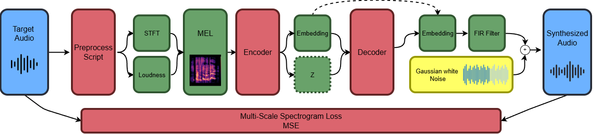
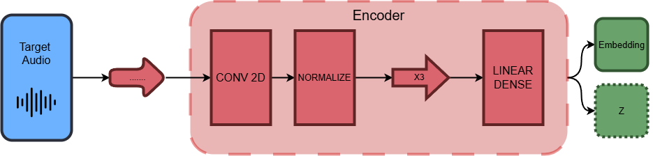
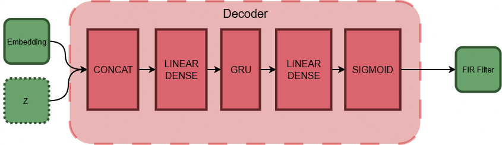

# NLF-SNAP: Noise-driven Latent Feature Synthesis Network for Audio Percussion. TFG Andrés Sánchez Ortiz. 

---

Este repositorio contiene el código, los experimentos y los resultados de mi Trabajo de Fin de Grado (TFG) centrado en la síntesis de sonidos percusivos. Para ello he diseñado e implementado una arquitectura de Autoencoders Variacionales Condicionales (CVAE), usando como núcleo principal un pipeline inspirado en [DDSP](https://github.com/magenta/ddsp).

He denominado a dicha arquitectura con el nombre **NLF-SNAP: Noise-driven Latent Feature Synthesis Network for Audio Percussion**. Esta arquitectura constituye una red neuronal generativa diseñada para la síntesis de sonidos percusivos organizados en 5 categorias arbitrarias: 

- Hi-Hats
- Kicks
- Snares
- Toms
- Percs

Dentro de la memoria me he centrado en explicar la arquitectura y en utilizarla como banco de pruebas para analizar cómo las diferentes estrategias de regularización del espacio latente (KLD Annealing, FREEBITS) influyen en la fidelidad perceptual (LSD/MSD) de los audios reconstruidos y generados.
  
## Estructura del Repositorio: 

El proyecto está organizado en las siguientes carpetas principales:

* **`/raw_dataset`**: Carpeta que contiene de forma organizada el dataset crudo, en 'PERCUSSION_CLASSES.txt se encuentra la división precisa de percusiones.
* **`/processed_dataset`**: Carpeta que contiene de forma organizada el dataset preprocesado en espectrogramas Mel. Estos son los datos que alimentan a la red.
* **`/CVAE_CSV`**: Contiene los historiales completos de entrenamiento (`training_history.csv`) de cada experimento, guardando métricas por época (Train KLD, Val MSS, etc.). 
* **`/checkpoints`**: Carpeta local donde se almacenan los pesos del modelo (`.pt`) de todas las épocas, marcando la mejor atendiendo a la pérdida total.
* **`/plots`**: Directorio principal de visualizaciones. Contiene las gráficas generadas automáticamente, divididas por experimento (evolución de pérdidas, radares acústicos y PCAs del espacio latente).
* **`/prints_logs`**: Contiene los prints de numerosas pruebas de entrenamiento conducidas antes de completar los epochs completos. 
* **`/CVAE_outputs`**: Archivos `.wav` generados por **NLF-SNAP** para su evaluación.
  * `/reconstruct`: Muestras de cada tipo generadas a partir de un sonido indicado.
  * `/sample`: Muestras generadas de forma independiente por la propia red.
  
## Scripts Principales:

### Arquitectura: 

* `tfg_encoder.py`: Define la red convolucional que comprime el espectrograma Mel en el espacio latente. 
* `tfg_decoder_NDDSP.py`: Módulo que genera un filtro LTV_FIR, este se utilizará para reconstruir el audio a partir del vector latente condicionado.
* `tfg_model.py`: Integra el Encoder y el Decoder, y aplica el truco de reparametrización $\mathcal{N}(0, I)$ característico del VAE.
* `tfg_loss_NDDSP_mss.py`: Calcula la pérdida en la construcción, estos valores serán los utilizados en la optimización del modelo.
* `tfg_NoiseSynth.py`: Construye en base al filtro el espectrograma final.

### Pipeline: 

* `tfg_train_mss.py`: Script central de entrenamiento de NLF-SNAP. Implementa el guardado inteligente de checkpoints basado en el mínimo `Val Total`.
* `tfg_dataset.py` y `tfg_dataloader.py`: Preparación y carga de los espectrogramas Mel a partir del dataset de audio original.
* `tfg_pca.py`: Aplicación de la técnica de reducción de dimensionalidad PCA (Análisis de Componentes Principales) para el análisis a posteriori de los modos de entrenamiento de la red. 

## Experimentos Clave: 

He llevado a cabo un análisis exhaustivo modificando la estrategia de pesos ($\beta$) de la divergencia Kullback-Leibler (KLD). Los experimentos completados son:

- **Baseline Fijo:** $\beta = 0.5$, $\beta = 1$ (Constante)
- **Free Bits:** $\beta = 0.5$, $\beta = 1$ (Constante)
- **Linear Annealing:** Rampas lineales de KLD (40, 60, 100 y 150 épocas).
- **Cyclical Annealing:** Ciclos periódicos de KLD ($T_{cycle}$ = 20, 40 y 100 épocas).

> **Hallazgo Principal:** Durante el proceso de entrenamiento, el uso de la pérdida total (`Val Total`) como criterio de guardado en el checkpoint en estrategias de *Annealing* genera falsos positivos, guardando modelos con peor calidad acústica (positivos tempranos a causa de la caída de KLD). La evaluación final demuestra empíricamente que priorizar la Pérdida de Reconstrucción Espectral (`Val MSS`) mejora drásticamente el error en la Distancia Perceptual Mel (MSD). 
    
## Modelo Ganador (The Best NLF-SNAP):

Tras la evaluación empírica de la distancia lineal (LSD) y perceptual a través de espectrogramas Mel (MSD), el modelo que presenta la mayor fidelidad de audio frente a los *samples* originales es el entrenado mediante **Linear Annealing de 150 Épocas (Guardado por BEST MSS)**.

*   **LSD Medio:** 11.27 dB
*   **MSD Medio:** 12.35 dB

## Trabajo Pendiente:

- [x]  Crear el script que transforme los tensores finales en audio.
- [x]  Completar un entrenamiento de 200 epochs y verificar resultados.
- [x]  ¿Falta una fuente armónica/periodicidad para KICKS, TOMS y PERCS?
- [x]  ¿compresión excesiva de SIGMOID?
- [x]  ¿Suficiente resolución inicial de 16kHZ? 
- [x]  ¿Colapso y superposición de de las clases latentes?
- [x]  Análisis PCA.
- [x]  Crear el script de test final, con respectivas gráficas y comparación de pérdidas.
- [ ]  Redacción completa de la memoria.

## Nota: 

Dentro de los propios archivos se encuentra toda la información detallada de los procesos informaticos y matemáticos utilizados pertinente para la evaluación correcta del modelo.  El orden recomendado de lectura es el siguiente: 

- PERCUSSION CLASSES.txt
- (raw_dataset) audi_processor.py
- preprocess_script.py  (processed_dataset)
- tfg_datatester.py
- tfg_encoder.py
- tfg_model.py
- tfg_decoder_NDDSP.py
- tfg_loss_NDDSP_mss.py
- tfg_dataset.py
- tfg_dataloader.py
- tfg_train_mss.py
- tfg_pca.py
- tfg_producer.py
- ./plots
- ./CVAE_outputs

---

## Diagramas de la Arquitectura. 

He hecho unos diagrámas para representar el pipeline de datos: 

1. Arquitectura General:
   
  
2. Diagrama del Encoder:
   

3. Diagrama del Decoder:
   
